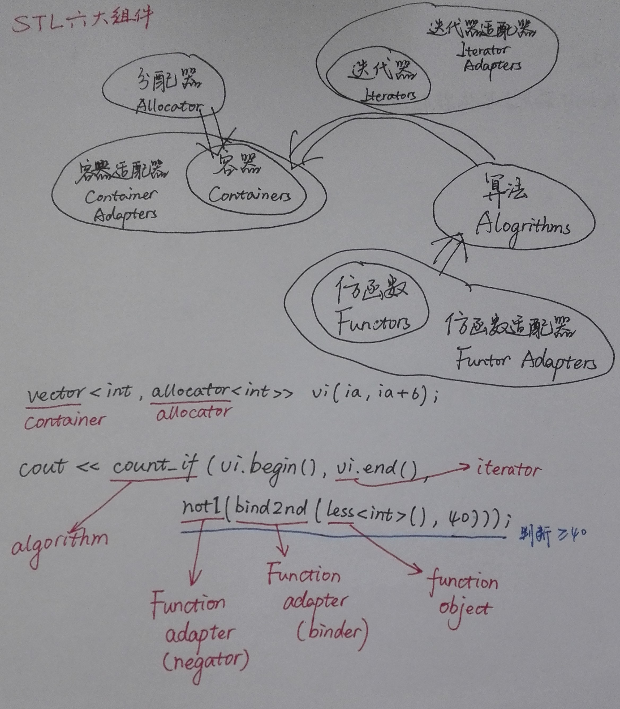
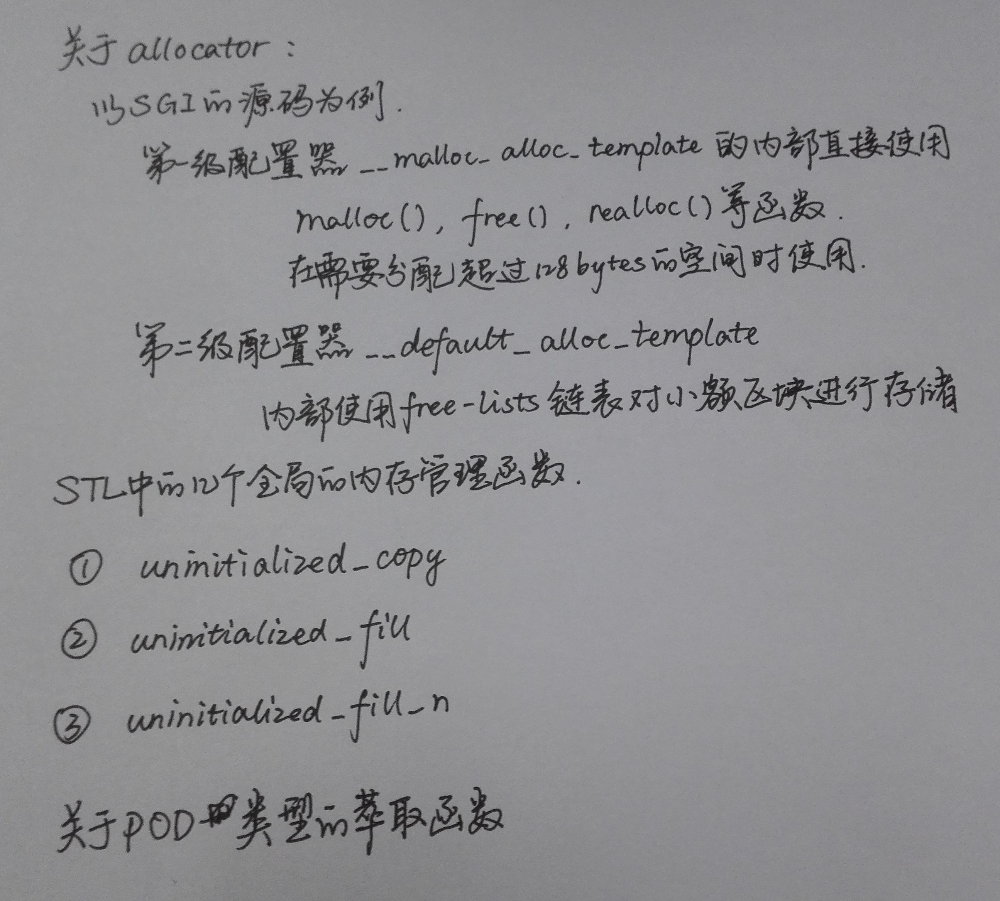
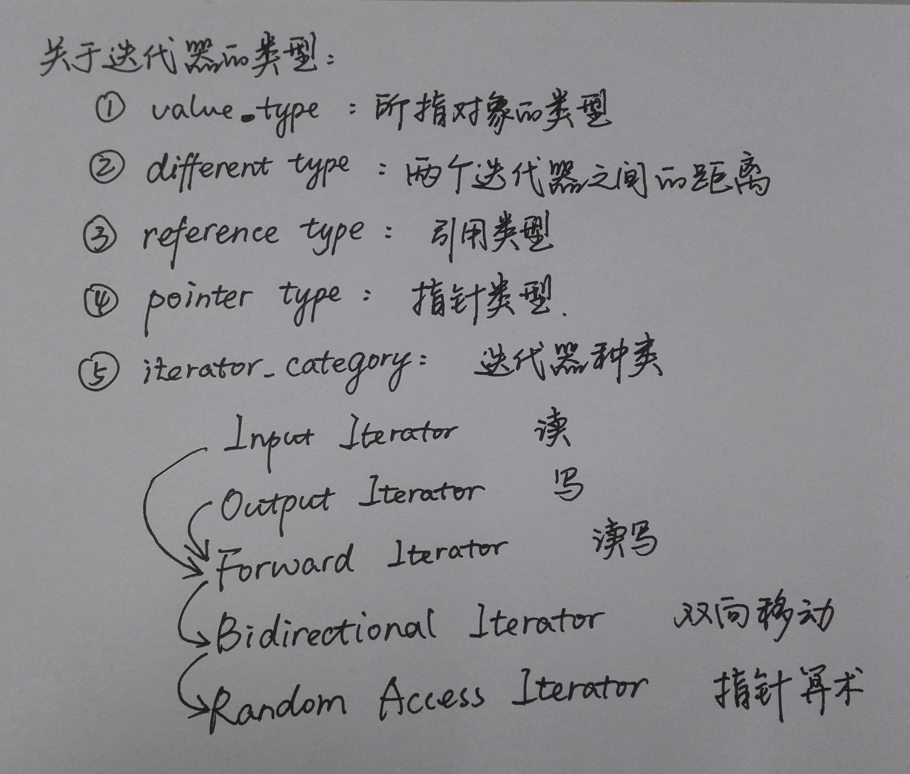

> 本系列**c++笔记系列**文章主要记录一些我碰到的c++的问题以及需要注意的内容。
> 本文主要讲述c++的标准库部分。
> 可能对读者阅读不友好...因为暂时是我自己的一些小整理，本文内容大部分整理自侯捷老师的课程。
> 曾经写过一些cpp的tricks： [some tricks of cpp](https://www.canftin.com/2017/some-tricks-of-cpp/)

呃。。。这篇暂时是篇奇葩文章。
<!--more-->

